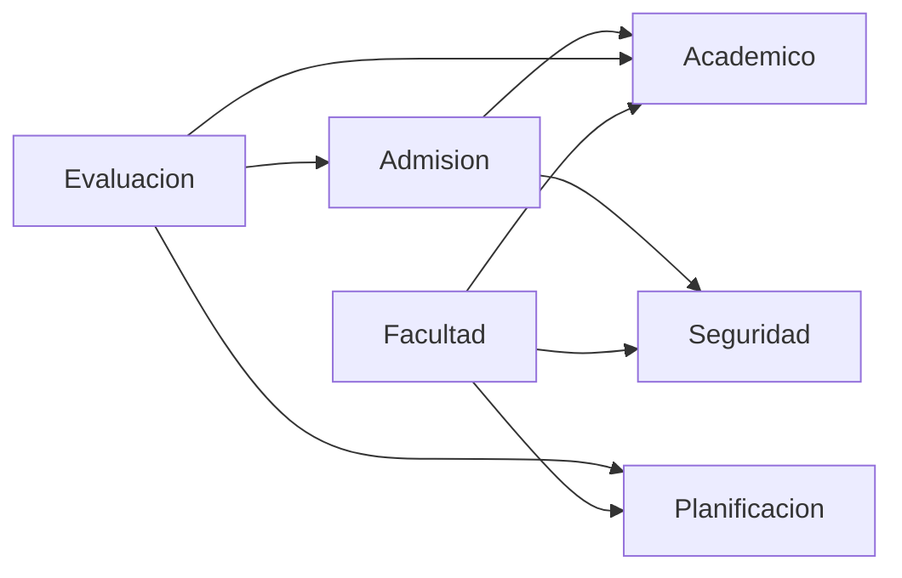

## Relaciones entre módulos

Breve resumen de las dependencias entre los módulos del proyecto y un diagrama Mermaid para visualizarlas.

**Relaciones detectadas (consumidor -> proveedor)**
- Admision -> Academico
- Admision -> Seguridad
- Evaluacion -> Admision
- Evaluacion -> Academico
- Evaluacion -> Planificacion
- Facultad -> Planificacion
- Facultad -> Academico
- Facultad -> Seguridad

**Ejemplos de referencias en el código**
- Registro de postulantes: [pagina-web-Cup/Modules/Admision/app/Http/Controllers/RegisterController.php](pagina-web-Cup/Modules/Admision/app/Http/Controllers/RegisterController.php#L6)
- Uso de Carrera en app: [pagina-web-Cup/app/Models/Carrera.php](pagina-web-Cup/app/Models/Carrera.php#L5)
- Provider del módulo Seguridad: [pagina-web-Cup/Modules/Seguridad/module.json](pagina-web-Cup/Modules/Seguridad/module.json#L1)
- Autoload de Academico: [pagina-web-Cup/Modules/Academico/composer.json](pagina-web-Cup/Modules/Academico/composer.json#L1)

**Diagrama Mermaid**

Si quieres, puedo exportar este diagrama a PNG/SVG o generar una lista completa de imports por módulo.
